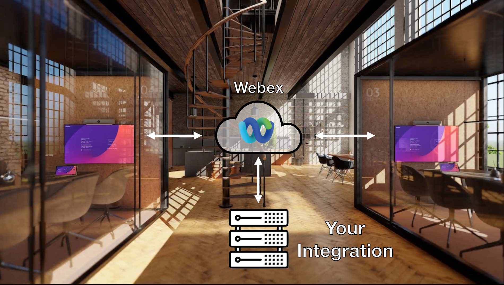

# Workspace Integrations Java SDK

A Java SDK for creating [Webex Workspace Integrations](https://developer.webex.com/docs/workspace-integrations).



The workspace integrations is a cloud based framework that lets you connect to the Cisco devices, receive sensor data, invoke
commands, read status values and update configs in a secure and controlled manner, without installing anything on the devices.

> **Warning**
> This SDK is in progress and not yet at version 1.0. Changes in the API must be expected.
> Also, there may be errors and typos in examples and documentation.
> Be sure to use the Github Issues to give feedback.

## Features

* Quick and easy to set up, just plug in the OAuth details you get from Control Hub
* Automatically handles OAuth access tokens for you, including refreshing it on time
* Convenient abstractions for a few key developer APIs like workspaces, devices and the device [XAPI](https://roomos.cisco.com/xapi/)
* Access device data:
    * Querying for status
    * Invoking commands
    * Subscribing to device XAPI events and status changes
* Support for both long polling and web hook for events and status updates

## Installation

1. Download and install the [Java SDK](https://adoptium.net/). Note that version 17 or later is required.
2. Download and install [maven](https://maven.apache.org/download.cgi).
3. Build and install the SDK with `mvn clean install` in the root directory.

The SDK consist of three projects:

### workspace-integrations-common
- DTO classes for the various APIs and 
- Utilities for JSON serialization / deserialization, JSON Web Token (JWT) handling etc.

### workspace-integrations-api
- Abstractions for the webex developer APIs (devices, workspaces, locations, xapi).
- HTTP library that seamlessly handles the OAuth tokens for you.
- Implements the activation code handling, hiding the nitty-gritty details.
- Provides change notification long polling. 

### workspace-integrations-examples
A few working example integrations you can try out.

## Getting started

The `examples` project will get you started using the SDK. Please visit the <a href="examples/README.md">examples readme</a> for more details.

Get a feel of how the Java SDK works with this little code snippet:

### Example code

```java
WorkspaceIntegration integration = new WorkspaceIntegration(
    "Your HTTP user agent",
    new OAuthClient("The clientID from Control Hub", "The client secret from Control Hub")
);
InitResult initResult = integration.init(
    "activation code from Control Hub",
    IntegrationUpdate.builder()
                     .provisioningState(COMPLETED)
                     .queue(enabledQueue())
                     .build()
);

// Store the provisioning details for later inits (includes the integration refresh token etc.)
Provisioning provisioning = initResult.provisioning()

// Convenient abstractions to call the various developer APIs...
WorkspacesApi workspacesApi = integration.getWorkspacesApi();
WorkspaceLocationsApi workspaceLocationsApi = integration.getWorkspaceLocationsApi();
DevicesApi devicesApi = integration.getDevicesApi();
XAPI xapi = integration.getXapi();

// Say read an xAPI status or execute a command for a given device
StatusResponse response = xapi.getStatus("deviceId", key("RoomAnalytics.*"));
xapi.executeCommand(key("Call.Disconnect"), new CommandRequest("deviceId"));

// Start an integration queue poller to get device change notifications via long polling
// All supported statuses and events in your integration manifest provides a change notificataion message
QueuePoller poller = integration.getQueuePoller((messages -> {
    LOG.info("Received messages: " + messages);
    messages.forEach((message) -> {
        if (message instanceof WebhookStatusMessage statusMessage) {
            statusMessage.getUpdatedStringValue(key("RoomAnalytics.AmbientTemperature"))
                         .ifPresent(temp -> {
                             LOG.info("Temperature updated to {} for device {}", temp, statusMessage.deviceId());
                         });
            statusMessage.getUpdatedStringValue(key("RoomAnalytics.AmbientNoise.Level.A"))
                         .ifPresent(ambientNoise -> {
                             LOG.info("Noise level updated to {} for device {}", ambientNoise, statusMessage.deviceId());
                         });
            statusMessage.getUpdatedStringValue(key("RoomAnalytics.RelativeHumidity"))
                         .ifPresent(humidity -> {
                             LOG.info("Relative humidity updated to {} for device {}", humidity, statusMessage.deviceId());
                         });
        }
    });
}));
poller.start();
```

## Limitations

Please be aware of the following limitations:

* There's a limited set of statuses and events you can subscribe to. See the "Supported Status" and "Supported Events" sections of the [developer docs](https://developer.webex.com/docs/workspace-integration-technical-details).
* On personal devices, you cannot use APIs that are listed as privacy impacting (see [roomos.cisco.com/xapi](https://roomos.cisco.com/xapi) to verify the APIs).
* If your integration has been allowed for only certain locations, you will still be able to list all the workspaces and devices in the org and
  manipulate configs, but only invoke commands and statuses for the devices in the allowed locations.
* Due to caching in the Webex cloud, it might take up to 60 minutes for all the devices in your organization to pick up on changes to your uploaded manifests. This applies to statuses and events that you expect to get change notifications for. Other changes like API scopes are immediate.

## Disclaimer

This SDK is shared _as is_ and with the goal of getting developers quickly introduced to the workspace integrations. If you encounter issues with the library or want changes, please raise Github issues and pull requests. 

The SDK _is not supported by Cisco TAC_.

## Useful resources

* [Workspace integrations guide](https://developer.webex.com/docs/workspace-integrations)
* [Introduction to the xAPI](https://roomos.cisco.com/doc/TechDocs/xAPI)
* [RoomOS xAPI reference](https://roomos.cisco.com/xapi)
* [Manifest editor](https://cisco-ce.github.io/workspace-integrations-editor/)