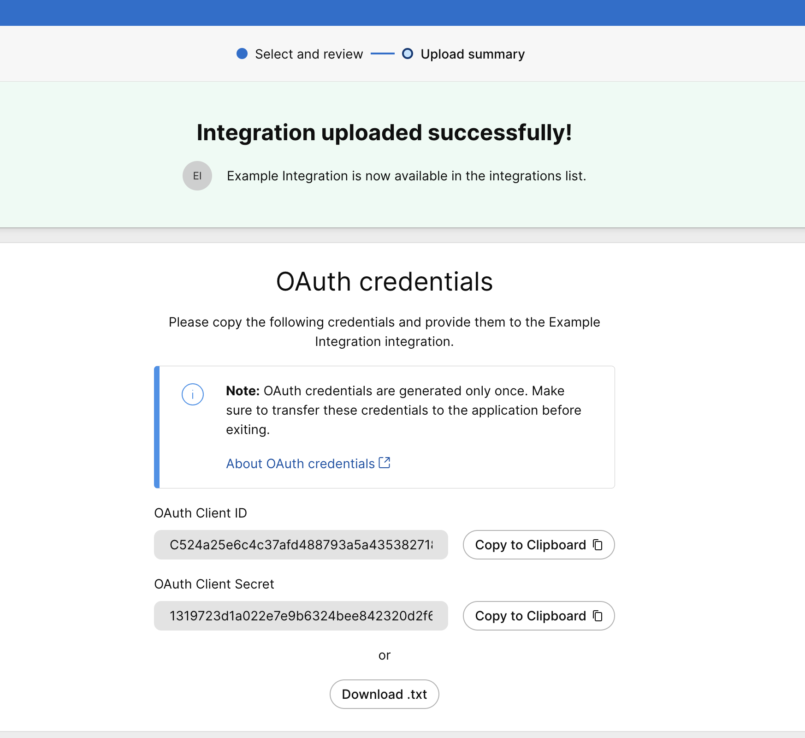
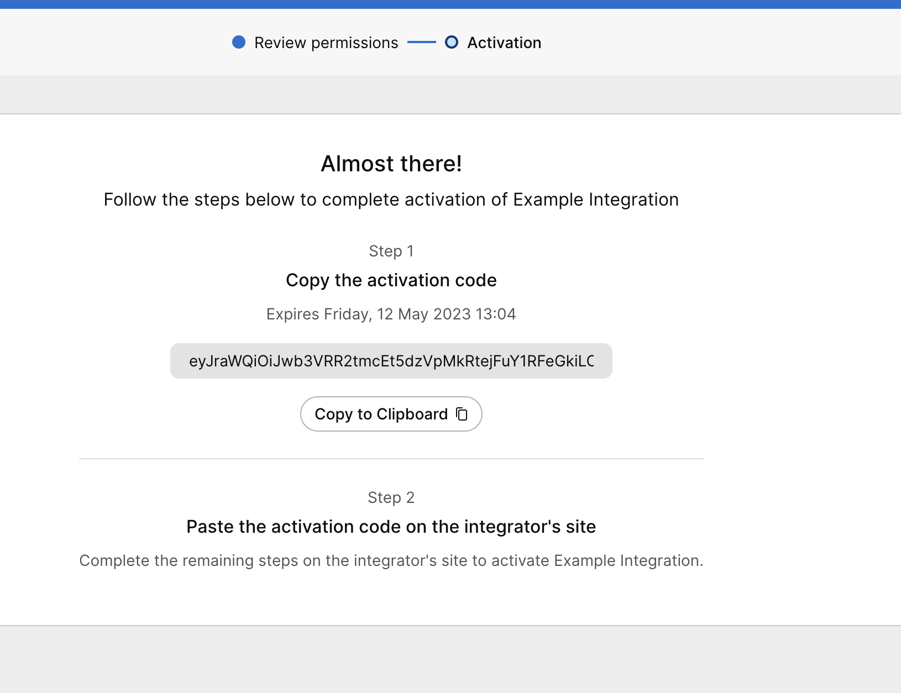

# Examples

The SDK comes with a few examples that you can look at to better understand how a workspace integration works:

- [Call satisfaction survey](#call-satisfaction-survey) 
- [Room capacity monitor](#room-capacity-monitor)
- [Environmental sensor data](#environmental-sensor-data)

This guide will walk through the steps necessary to get the examples up and running in a few minutes.

Common to all the examples are the following steps:

### 1. Write the integration manifest

When you create an integration you must provide a manifest that describes what your integration does, what developer API scopes, 
XAPI commands, events and statuses it needs access to.

You can create the manifest file yourself or use the [visual editor](https://cisco-ce.github.io/workspace-integrations-editor/).

Each of the examples have a corresponding manifest file under the <a href="src/main/resources/manifests">resources/manifests</a> directory.

### 2. Create a workspace integration in Control Hub

A workspace integration is created in the [Control Hub Workspaces Integrations page](https://admin.webex.com/workspaces/integrations) using the manifest "Upload integration" option:

Select the manifest file to upload and store the returned OAuth Client ID and OAuth Client Secret:

The OAuth Client ID and secret will be used when you start the example.

### 3. Activate the integration

After the integration is created it must be activated on the integration details page:

The activation wizard provides an activation code (JWT):

You know have the three things you need:

- OAuth client ID
- OAuth client secret
- Activation code

Let's move on to the examples...

## Call satisfaction survey

This example displays a rating survey on the devices after a call disconnects using:

1. The [CallDisconnect](https://roomos.cisco.com/xapi/Event.CallDisconnect) event to detect when a call has ended,
2. The [UserInterface.Message.Rating.Display](https://roomos.cisco.com/xapi/Command.UserInterface.Message.Rating.Display) command to show a rating dialog on the device user interface and
3. The [UserInterface.Message.Rating.Respons](https://roomos.cisco.com/xapi/Event.UserInterface.Message.Rating.Response) event to capture the rating.

### Setup

1. Upload the <a href="src/main/resources/manifests/callsatisfactionsurvey.json">callsatisfactionsurvey.json</a> manifest and capture the OAuth clientId, secret and activation code (JWT) as described above.
2. Run the example providing the clientId and secrets as program arguments.
3. The first time the example is run, you will need to provide the activation code as a command line input.

#### Run from IntelliJ

#### Run from command line

1. Go to the root project directory and run  `mvn clean install -P callsatisfactionsurvey`
2. Start the example by running `java -jar examples/target/callsatisfactionsurvey.jar <clientId> <clientSecret>`

## Room capacity monitor

This example displays a prompt on the device if the number of people detected by the device exceeds the capacity stored for the workspace in Control Hub.

1. The [RoomAnalytics.PeopleCount.Current](https://roomos.cisco.com/xapi/Status.RoomAnalytics.PeopleCount.Current) status is used to track the people count,
2. The [Workspaces GET API](https://developer.webex.com/docs/api/v1/workspaces/get-workspace-details) is used to fetch the capacity,
3. The [UserInterface.Message.Alert.Display](https://roomos.cisco.com/xapi/Command.UserInterface.Message.Alert.Display) command shows an alert on the device.

### Setup

1. Upload the <a href="src/main/resources/manifests/roomcapacitymonitor.json">roomcapacitymonitor.json</a> manifest and capture the OAuth clientId, secret and activation code (JWT) as described above.
2. Run the example providing the clientId and secrets as program arguments.
3. The first time the example is run, you will need to provide the activation code as a command line input.

#### Run from IntelliJ

#### Run from command line

1. Go to the root project directory and run  `mvn clean install -P roomcapacitymonitor`
2. Start the example by running `java -jar examples/target/roomcapacitymonitor.jar <clientId> <clientSecret>`

## Environmental sensor data

This example captures environmental sensor data from the devices: 

1. [RoomAnalytics.AmbientTemperature](https://roomos.cisco.com/xapi/Status.RoomAnalytics.AmbientTemperature)
2. [RoomAnalytics.RelativeHumidity](https://roomos.cisco.com/xapi/Status.RoomAnalytics.RelativeHumidity)
3. [RoomAnalytics.AmbientNoise.Level.A](https://roomos.cisco.com/xapi/Status.RoomAnalytics.AmbientNoise.Level.A)

### Setup

1. Upload the <a href="src/main/resources/manifests/roomcapacitymonitor.json">environmentaldata.json</a> manifest and capture the OAuth clientId, secret and activation code (JWT) as described above.
2. Run the example providing the clientId and secrets as program arguments.
3. The first time the example is run, you will need to provide the activation code as a command line input.

#### Run from IntelliJ

#### Run from command line

1. Go to the root project directory and run  `mvn clean install -P environmentaldata`
2. Start the example by running `java -jar examples/target/environmentaldata.jar <clientId> <clientSecret>`

## Gotchas

1. Due to caching in the Webex cloud, it might take up to 60 minutes for all the devices in your organization to pick up on changes to your uploaded manifests. If you are testing with a specific device, then a reboot will speed up the process.
2. Note that a workspace integration will (if nothing else is specified) get access to all workspaces and devices in your organization. To avoid causing problems when running the examples, we recommend to limit the integration access to a location with only the devices you want to test.